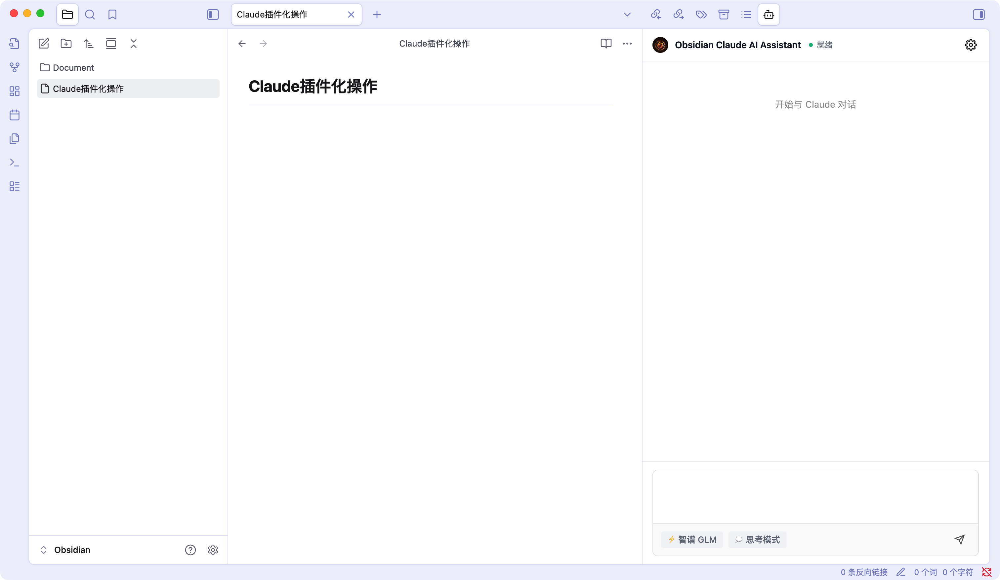

# Obsidian Claude AI Assistant

> 在Obsidian中享受专业的AI对话体验，支持多家主流AI服务商
>
> 🎨 现代化扁平设计，简洁高效

[](https://opensource.org/licenses/MIT)
[](https://obsidian.md)

## ✨ 功能特性

### 🎨 界面设计

- **现代化扁平设计**：简洁美观的Chatbox风格界面
- **圆形Logo图标**：精致的视觉标识
- **智能消息布局**：用户消息浅灰背景，AI消息透明背景
- **Markdown渲染**：完整支持Markdown格式显示
- **代码高亮**：支持代码块语法高亮
- **扁平化按钮**：简洁的发送按钮设计
- **响应式设计**：完美适配不同屏幕尺寸



### 🤖 多AI服务商支持

| 服务商 | 模型 | 推荐场景 |
|--------|------|----------|
| **智谱AI (GLM)** | glm-4-plus, glm-4-air, glm-4-flash, glm-4 | 💰 性价比高 |
| **OpenAI (GPT)** | gpt-4o, gpt-4o-mini, gpt-4-turbo | 🌍 国际化 |
| **Anthropic (Claude)** | claude-3-5-sonnet, claude-3-opus | 🧠 复杂推理 |
| **阿里云 (通义千问)** | qwen-max, qwen-plus, qwen-turbo | 🇨🇳 中文优化 |
| **DeepSeek** | deepseek-chat, deepseek-coder | 💻 编程助手 |
| **月之暗面 (Kimi)** | moonshot-v1-8k/32k/128k | 📚 长文本 |

### 🎯 核心功能

- **多AI服务商支持**：灵活切换6种主流AI服务
- **实时流式对话**：打字机效果的流式输出
- **对话历史管理**：自动保存和加载对话记录
- **Markdown格式渲染**：完整的Markdown支持
- **灵活认证**：支持设置面板配置API Key
- **简洁设置**：简单的设置面板，轻松配置

### 🎨 界面特性

- **Chatbox风格设计**：简洁、现代、美观
- **圆形Logo**：24px精致圆形图标
- **扁平化按钮**：简洁的发送按钮，悬停时与Tag标签风格统一
- **流式输出动画**：实时显示AI回复过程
- **智能状态标签**：显示当前使用的AI模型
- **清爽的消息布局**：用户消息浅灰背景，AI消息透明

## 📦 安装

### 从源码安装

```bash
# 1. 克隆仓库
git clone https://github.com/yourusername/obsidian-claude-ai.git
cd obsidian-claude-ai

# 2. 安装依赖
npm install

# 3. 构建
npm run build

# 4. 部署到Obsidian（需要修改deploy.mjs中的路径）
npm run deploy
```

### 手动安装

1. 下载最新版本的[Release](https://github.com/yourusername/obsidian-claude-ai/releases)
2. 解压到你的Obsidian vault目录：`你的vault/.obsidian/plugins/obsidian-claude-ai/`
3. 在Obsidian设置中启用插件

### 插件目录位置

⚠️ **重要**：插件应安装在vault目录下，而非全局目录

```
你的vault/
└── .obsidian/
    └── plugins/
        └── obsidian-claude-ai/
            ├── main.js
            ├── manifest.json
            └── styles.css
```

## ⚙️ 配置

### 快速开始（推荐智谱GLM）

1. 打开Obsidian设置 → Claude AI Assistant
2. 选择"智谱AI (GLM)"
3. 输入你的智谱API Key
4. 选择模型"glm-4-flash"
5. 点击侧边栏的 AI 图标开始使用！

### API Key配置

#### 插件设置面板（推荐）

1. 打开Obsidian设置
2. 找到"Claude AI Assistant"
3. 选择AI服务商
4. 在对应字段输入API Key
5. 选择模型
6. 保存

### 获取API Key

| 服务商 | 注册地址 | 价格 | 免费额度 |
|--------|----------|------|----------|
| [智谱AI](https://open.bigmodel.cn/) | [点击注册](https://open.bigmodel.cn/) | 💰 | 新用户赠送 |
| [OpenAI](https://platform.openai.com/) | [点击注册](https://platform.openai.com/) | 💎💎💎 | $5免费额度 |
| [Anthropic](https://console.anthropic.com/) | [点击注册](https://console.anthropic.com/) | 💎💎 | 新用户赠送 |
| [通义千问](https://bailian.console.aliyun.com/) | [点击注册](https://bailian.console.aliyun.com/) | 💰💰 | 新用户赠送 |
| [DeepSeek](https://platform.deepseek.com/) | [点击注册](https://platform.deepseek.com/) | 💰 | 极低价格 |
| [Kimi](https://platform.moonshot.cn/) | [点击注册](https://platform.moonshot.cn/) | 💰💰 | 新用户赠送 |

## 📚 使用指南

### 开始对话

1. 打开Obsidian右侧边栏
2. 点击 AI 图标打开对话面板
3. 在输入框中输入消息
4. 按Enter发送（Shift+Enter换行）
5. 实时查看AI的流式响应

### 对话管理

- **自动保存**：对话自动保存，下次打开自动加载
- **新建对话**：清空当前对话开始新的会话

### Markdown支持

AI回复支持完整的Markdown格式：
- 标题（# ## ###）
- **粗体** 和 *斜体*
- 列表（有序、无序）
- `代码` 和 ```代码块```
- [链接](url)
- > 引用
- 表格

### 快捷操作

- **Enter**：发送消息
- **Shift + Enter**：换行
- **点击发送按钮**：发送消息

## 🏗️ 开发

### 项目结构

```
obsidian-claude-ai/
├── src/
│   ├── main.ts                 # 插件入口
│   ├── plugin.ts               # 核心插件类
│   ├── types/
│   │   └── index.ts            # 全局类型定义
│   ├── api/                    # API集成层
│   │   ├── auth/               # 认证管理
│   │   │   └── auth-manager.ts
│   │   └── claude/             # AI客户端
│   │       └── universal-client.ts  # 通用AI客户端
│   ├── ui/                     # 用户界面
│   │   ├── sidebar/
│   │   │   └── chat-view.ts    # 聊天视图
│   │   └── settings/
│   │       └── settings-tab.ts # 设置面板
│   └── storage/                # 数据持久化
│       └── conversation-store.ts
├── resources/
│   └── styles.css              # 样式文件
├── manifest.json
├── package.json
├── tsconfig.json
├── esbuild.config.mjs
└── deploy.mjs                  # 部署脚本
```

### 架构设计

#### 事件驱动的UI层

```typescript
class ChatView extends ItemView {
    // 所有事件处理都是类方法，避免闭包问题
    private handleSendButtonClick(): void {
        this.sendMessage(content);
    }

    private async sendMessage(content: string): Promise<void> {
        // 清晰的异步流程
    }
}
```

#### 通用AI客户端

支持多个AI服务商，统一接口：

```typescript
class UniversalAIClient {
    async sendMessage(messages: Message[]): Promise<string>
    async sendMessageStream(messages: Message[], options): Promise<string>
}
```

### 开发命令

```bash
# 安装依赖
npm install

# 生产构建
npm run build

# 部署到Obsidian（需要先配置deploy.mjs中的路径）
npm run deploy
```

### 技术栈

- **TypeScript** - 类型安全
- **Obsidian Plugin API** - 插件框架
- **esbuild** - 快速打包
- **设计灵感** - [Chatbox](https://github.com/Bin-Huang/chatbox)

## ❓ 常见问题

### Q: 插件不显示怎么办？

A: 确保插件安装在vault目录：
```
你的vault/.obsidian/plugins/obsidian-claude-ai/
```

### Q: 提示"plugin is not defined"错误？

A: 这个问题在 v0.2.0 已修复。请确保：
1. 完全退出 Obsidian（Cmd+Q）
2. 重新部署最新版本
3. 重新打开 Obsidian

### Q: API Key无效？

A:
1. 检查API Key格式是否正确
2. 确认API Key未过期
3. 确认选择了正确的服务商

### Q: 如何切换AI服务商？

A:
1. 打开插件设置
2. 在"AI服务商"下拉框中选择
3. 输入对应服务商的API Key
4. 选择模型
5. 保存

### Q: 支持哪些模型？

A: 每个服务商支持不同模型，详见上方"支持的AI服务商"表格。推荐配置：
- **性价比**：智谱GLM-4-flash
- **质量**：Claude 3.5 Sonnet / GPT-4o
- **编程**：DeepSeek-coder
- **长文本**：Kimi moonshot-v1-128k

### Q: 如何查看对话历史？

A: 对话自动保存，每次打开侧边栏会自动加载上次的对话。点击"新对话"按钮可以开始新的对话。

## 🗺️ 路线图

### 已完成 ✅

- [x] 多AI服务商支持（智谱、OpenAI、Claude、通义千问、DeepSeek、Kimi）
- [x] 实时流式对话
- [x] 对话历史管理
- [x] Markdown格式渲染
- [x] Chatbox风格UI重构
- [x] 事件驱动架构
- [x] 通用AI客户端
- [x] 扁平化界面设计
- [x] 圆形Logo图标
- [x] 响应式消息布局

### 计划中 📋

- [ ] Skills系统
- [ ] SubAgent并行引擎
- [ ] 对话历史导出
- [ ] 多语言UI
- [ ] 主题定制
- [ ] 更多AI服务商

## 🤝 贡献

欢迎贡献代码、报告问题或提出建议！

### 贡献步骤

1. Fork本仓库
2. 创建特性分支 (`git checkout -b feature/AmazingFeature`)
3. 提交更改 (`git commit -m 'Add some AmazingFeature'`)
4. 推送到分支 (`git push origin feature/AmazingFeature`)
5. 开启Pull Request

### 代码风格

- 遵循TypeScript最佳实践
- 使用类方法而非闭包处理事件
- 保持代码简洁和可读性
- 添加适当的注释

## 📜 许可证

本项目基于 [MIT](LICENSE) 许可证开源。

## 🙏 致谢

- [Chatbox](https://github.com/Bin-Huang/chatbox) - 优秀的设计理念和架构启发
- [Obsidian](https://obsidian.md/) - 强大的知识管理工具
- [智谱AI](https://open.bigmodel.cn/) - 国产AI服务
- [OpenAI](https://openai.com/) - GPT提供商
- [Anthropic](https://www.anthropic.com/) - Claude提供商
- [阿里云](https://aliyun.com) - 通义千问提供商
- [DeepSeek](https://www.deepseek.com/) - DeepSeek提供商
- [月之暗面](https://www.moonshot.cn/) - Kimi提供商

## ⭐ 支持

如果这个插件对你有帮助，请给个⭐️支持一下！

有问题或建议？欢迎提交[Issue](https://github.com/yourusername/obsidian-claude-ai/issues)！

## 📞 联系方式

- 作者：KingKong
- 邮箱：hunanjingang@gmail.com

---

<div align="center">

**Made with ❤️ by the community**

**Inspired by [Chatbox](https://github.com/Bin-Huang/chatbox)**

</div>
